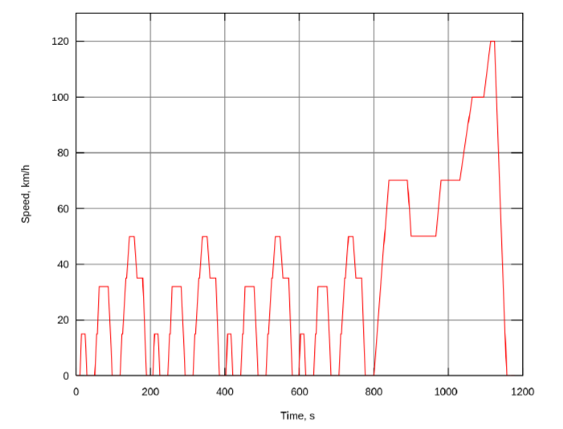
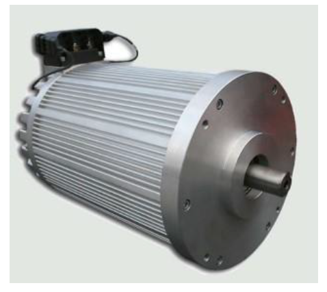
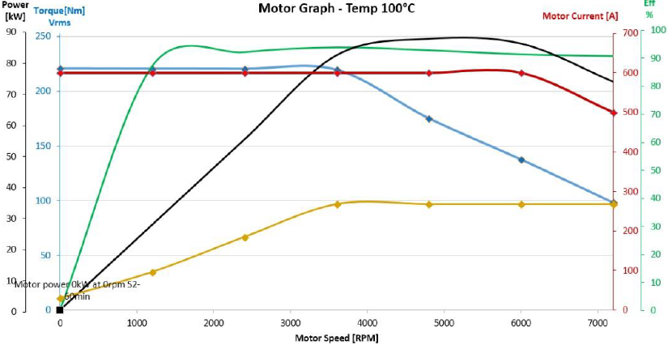
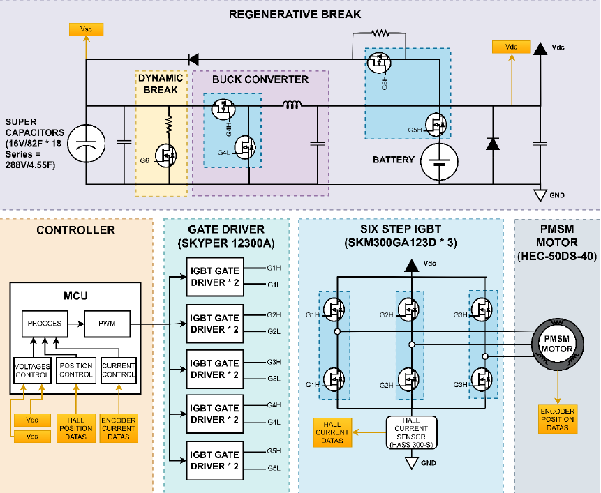
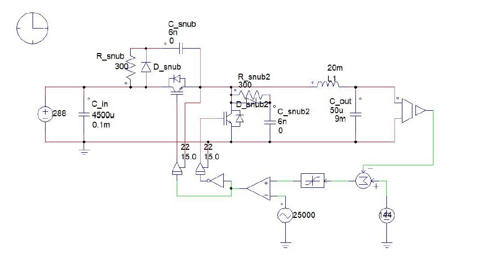
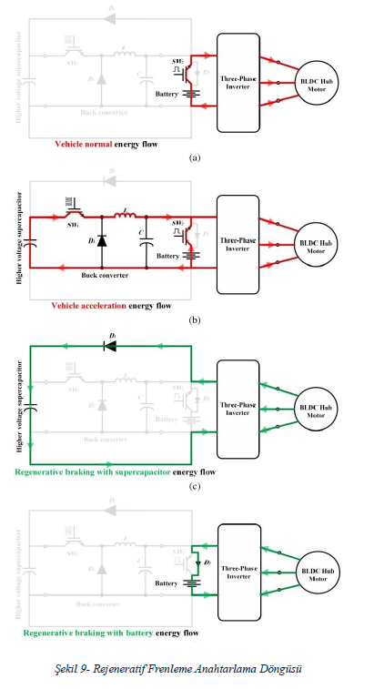

# PMSM Motor Driver Design for Electric Vehicle

This repository contains the design and simulation work of a **Permanent Magnet Synchronous Motor (PMSM) driver** developed for an electric vehicle.  
The system includes a **6-step inverter**, **IGBT-based power stage**, **gate drivers**, **Hall-effect feedback**, and a **regenerative braking unit** designed with a **buck converter + supercapacitors**.

The project also includes a **MATLAB simulation** that performs force calculations, torque–speed analysis, battery sizing, and regenerative braking energy estimation based on the NEDC driving cycle.

---

## Project Overview

This project focuses on designing a motor driver for a small electric vehicle with:

- **300 km driving range**
- **1200 kg vehicle weight**
- **NEDC drive cycle–based energy consumption**
- **6-step commutation method**
- **Supercapacitor-supported regenerative braking**

The design ensures the PMSM meets the necessary torque–speed conditions while maintaining DC-link stability during regen events.

---

## Visual Overview

Below are core visuals from the system and analysis:

### **NEDC Drive Cycle**

---

### **Selected PMSM Motor (Hyper 9 EV)**

---

### **Motor Torque–Speed Curve (T-N Graph)**

---

### **System Block Diagram**

---

### **Buck Converter Used in Regenerative Braking**

---

### **Regenerative Braking Switching Diagram**

---

## ⚙️ Features

- **6-Step PMSM Commutation**
- **3-Phase Full-Bridge IGBT Power Stage**
- **Regenerative Braking with Supercapacitor Storage**
- **MATLAB-Based System-Level Simulation**
  - Aerodynamic drag analysis
  - Rolling & slope resistance calculations
  - Battery sizing for 300 km range (30% remaining SoC)
  - Torque–speed–power requirement modeling
  - Regenerative braking energy calculation

---

## MATLAB Simulation

This script performs:

- NEDC-based total resisting force calculation  
- Required motor torque & power computation  
- Battery capacity estimation  
- Motor speed (RPM) vs vehicle speed mapping  
- Regenerative braking energy stored in supercapacitors  
- Plot generation for torque, speed, power, and forces  
